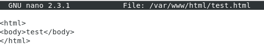
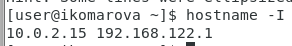

# Лабораторная работа 6.
## Мандатное разграничение прав в Linux

## Выполнила студентка группы НФИбд-02-19: Комарова Ирина Сргеевна 1032192866

## Задание
    Развить навыки администрирования ОС Linux. Получить первое практическое знакомство с технологией SELinux1.
    Проверить работу SELinx на практике совместно с веб-сервером Apache.

## Теоретическое введение
В Linux, как и в любой многопользовательской системе, абсолютно естественным образом возникает задача разграничения доступа субъектов — пользователей к объектам — файлам дерева каталогов.

Один из подходов к разграничению доступа — так называемый дискреционный (от англ, discretion — чье-либо усмотрение) — предполагает назначение владельцев объектов, которые по собственному усмотрению определяют права доступа субъектов (других пользователей) к объектам (файлам), которыми владеют.

Дискреционные механизмы разграничения доступа используются для разграничения прав доступа процессов как обычных пользователей, так и для ограничения прав системных программ в (например, служб операционной системы), которые работают от лица псевдопользовательских учетных записей.

Назначаются владельцы файлов при их создании — обычно пользователем — владельцем файла становится пользователь, создавший файл, а группой — владельцем файла становится его первичная группа.

Изменяются пользователь — владелец файлов только суперпользователем root при помощи команды chown, а группа-владелец — владельцем файла в при помощи команды chgrp, но только на ту, к которой он сам принадлежит.

## Ход работы.
1.  Вошла в систему после её настройки.

2. Обратилась с помощью браузера к веб-серверу и убедилась, что работает:
service httpd status

3. Нашла веб-сервер Apache в списке процессов, определила его контекст
безопасности.
ps auxZ | grep httpd

4. Посмотрела текущее состояние переключателей SELinux для Apache с
помощью команды
sestatus -bigrep httpd
5. Посмотрела статистику по политике с помощью команды seinfo.

6. Создала от имени суперпользователя html-файл
/var/www/html/test.html 

7. Проверила контекст созданного файла.

8. Обратилась к файлу через веб-сервер, введя в браузере адрес
http://127.0.0.1/test.html. Я обратилась по другому хосту.

9. Изучила справку man httpd_selinux и выяснила, какие контексты файлов определены для httpd. 
10. Выполнила:
chcon -t samba_share_t /var/www/html/test.html
ls -Z /var/www/html/test.html

11. Попробовала ещё раз получить доступ к файлу через веб-сервер, введя в
браузере адрес http://127.0.0.1/test.html. Получила ошибку.

12. Попробовала запустить веб-сервер Apache на прослушивание ТСР-порта 81. Нашла строчку Listen 80 и
заменила её на Listen 81.

13. Выполнила перезапуск веб-сервера Apache. Ошибки не было.

14. Проанализировала лог-файлы:
tail -nl /var/log/messages
Просмотрите файлы /var/log/http/error_log,
/var/log/http/access_log и /var/log/audit/audit.log.

16. Попробовала запустить веб-сервер Apache ещё раз. Получилось.
17. Вернула контекст httpd_sys_cоntent__t к файлу /var/www/html/ test.html:
chcon -t httpd_sys_content_t /var/www/html/test.html
После этого получила доступ к файлу через веб-сервер.

18. Исправила обратно конфигурационный файл apache, вернув Listen 80.
19. Удалила привязку http_port_t к 81 порту:
semanage port -d -t http_port_t -p tcp 81

20. Удалила файл /var/www/html/test.html:
rm /var/www/html/test.html

## Вывод 
    Я развила навыки администрирования ОС Linux. Получила первое практическое знакомство с технологией SELinux1.
    Проверила работу SELinx на практике совместно с веб-сервером Apache.

## Библиография
1. Методические материалы курса. “Информационная безопасность компьютерных сетей” Кулябов Д. С.,Королькова А. В., Геворкян М. Н.